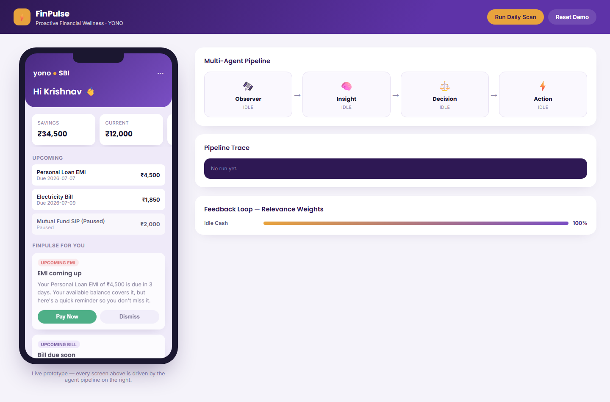

# FinPulse — Proactive Financial Wellness Agent for SBI YONO

FinPulse is a lightweight, AI-style financial wellness prototype that helps users make better money decisions by surfacing timely nudges from their financial activity. The experience is built around a four-agent pipeline that watches account behaviour, turns events into insights, scores them for relevance, and delivers actionable recommendations.

## Problem Statement

Many users miss bill payments, keep idle money in savings accounts, or forget recurring investments. Traditional banking apps require users to actively search for financial information instead of proactively guiding them.

FinPulse addresses this by continuously monitoring financial activity and delivering intelligent, context-aware recommendations through an AI-inspired multi-agent pipeline.

## Why this project matters

- Detects idle cash and suggests moving it to a liquid fund
- Warns users before an EMI or bill is due
- Highlights paused SIPs that may need a reminder
- Turns financial signals into clear nudges instead of waiting for the user to search manually

## About

Built as a prototype for the SBI Hackathon, FinPulse demonstrates how proactive financial wellness can be delivered through an AI-inspired multi-agent architecture integrated with digital banking workflows.

## Features

- Proactive financial nudges for everyday banking behaviour
- Multi-agent pipeline with visible trace output
- Mock external-service actions such as fund investment, bill payment, and SIP starts
- Feedback-driven scoring that adapts over time
- Flask-based prototype with a simple, interactive web interface.

## Live screenshots

The screenshots below are captured from the live demo site so visitors can quickly see the experience in action.



## AI Pipeline


## Architecture → Code map

| Diagram block | Code |
|---|---|
| Ingestion Layer / Cache Queue | services/cache.py |
| Observer Agent | agents/observer_agent.py |
| Insight Agent | agents/insight_agent.py |
| Decision Agent | agents/decision_agent.py |
| Action Agent | agents/action_agent.py |
| Operational Database | services/database.py |
| ML / NLP Service | services/ml_service.py |
| External Services | services/external_services.py |
| Feedback Loop | services/feedback_loop.py |

## How the pipeline runs

The backend exposes POST /api/run-pipeline/<user_id>, which runs the full flow in order:

1. Observer Agent scans accounts, transactions, and schedules for meaningful events.
2. Insight Agent converts those events into actionable insights.
3. Decision Agent ranks each insight by urgency and relevance.
4. Action Agent delivers the generated nudges and executes the chosen action when the user taps it.
5. The feedback loop adjusts future scoring based on accept and dismiss behaviour.

The UI shows the trace of each step so the agent hand-off is visible in real time.

## Running locally

```bash
cd finpulse
python3 -m venv venv
source venv/bin/activate
pip install -r requirements.txt
python app.py
```

Open http://localhost:5000 and click Run Daily Scan to trigger the demo scenario.

## Project structure

```text
finpulse/
├── app.py
├── agents/
│   ├── observer_agent.py
│   ├── insight_agent.py
│   ├── decision_agent.py
│   └── action_agent.py
├── services/
│   ├── database.py
│   ├── cache.py
│   ├── ml_service.py
│   ├── external_services.py
│   └── feedback_loop.py
├── templates/
├── static/
└── requirements.txt
```

## Live demo

- Deployed on Railway: https://web-production-ae2da.up.railway.app/

## Tech stack

- Python
- Flask
- SQLite
- HTML/CSS/JavaScript
- REST APIs

## Next steps

- Replace the mock services with real SBI/YONO integrations
- Move from SQLite to PostgreSQL for production readiness
- Add authentication, audit logging, and stronger security controls
- Swap the template-based copy with a real LLM for richer nudges
